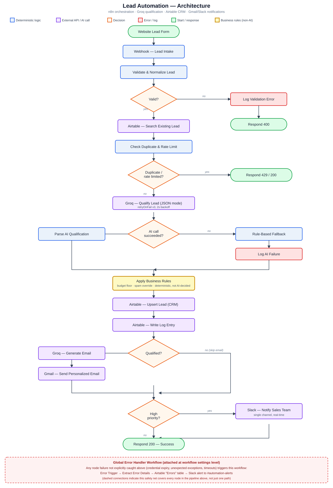

# Lead Automation — AI Automation Expert Technical Assessment

**Video Walkthrough:** [https://www.loom.com/share/8e012a478a6e493bb81561ad31c52e52](https://www.loom.com/share/8e012a478a6e493bb81561ad31c52e52)

Automates a client's manual lead-review process end to end: a lead comes in
through a webhook, gets validated, qualified and scored by an LLM (with a
deterministic rule-based fallback if the AI call fails), upserted into a CRM
without creating duplicates, sent a personalized reply email if qualified,
and routed to a Slack notification if high priority — with logging, retries,
and centralized error handling throughout.

## Architecture



```
Webhook (intake)
  -> Validate & Normalize (deterministic)
     -> invalid -> log to Logs (Type: error) -> 400 response
     -> valid
        -> Airtable: search existing lead by email
           -> Check duplicate (idempotency key + 5-min window) & submission throttling
              -> blocked -> 429/200 response, no reprocessing
              -> not blocked
                 -> Groq (openai/gpt-oss-120b): qualify/categorize/score lead (JSON mode)
                    -> failed -> rule-based fallback categorization + log to Logs
                    -> succeeded -> parse JSON
                 -> Apply Business Rules (deterministic overrides: budget floor,
                    spam override, company-provided floor) — priority is never
                    decided by the LLM alone
                    -> Airtable: upsert Lead (create; keyed on Email + idempotency key)
                       -> Airtable: write Log entry (Type: info)
                          -> qualified?
                             -> yes: Groq generates personalized email -> Gmail sends it
                                (failure logged to Logs, doesn't block the pipeline)
                             -> priority == high?
                                -> yes: Slack notifies the sales channel
                          -> 200 response with lead outcome
```

A separate **Error Handler workflow** is attached at the n8n workflow-settings
level (Settings → Error Workflow), so any node failure not explicitly caught
inline (credential expiry, unexpected exceptions, timeouts) is still caught,
logged to Airtable, and reported — without needing to be re-implemented on
every node.

## Tech stack & why

| Piece | Choice | Why |
|---|---|---|
| Orchestration | **n8n** (self-hosted) | Visual graph doubles as the architecture diagram/talking points for the video; fast to build inside a 24-hour window; each step is independently testable in isolation |
| AI qualification/copy | **Groq** (`openai/gpt-oss-120b`, OpenAI-compatible API) | Fast inference, JSON-mode structured output, generous free tier |
| CRM | **Airtable** | Fast to stand up a relational-enough CRM with search/upsert and select-field validation, without owning database infrastructure; realistic stand-in for a client's actual CRM (swap-in-ready for HubSpot/Salesforce later) |
| Email | **Gmail (OAuth2)** | Directly testable, no extra sending-domain setup needed for a demo |
| Notifications | **Slack** | Real-time, and the client's sales team is the actual audience for high-priority alerts |
| Business-rule layer | **Plain n8n Code nodes**, deliberately separate from the AI call | The assessment explicitly calls for decisions that "should not depend entirely on AI" — priority/category overrides are hard-coded logic, not LLM output |

## Data model

Two Airtable tables, deliberately kept to the minimum the requirements call for:

**`Leads`** — the CRM record. One row per unique lead, created and matched on
`Email` + `IdempotencyKey`.
`Name, Email, Phone, Company, Source, Budget, Timeline, Message, Category,
Priority, Score, Summary, Status, IdempotencyKey, SubmittedAt, AIFallbackUsed`

**`Logs`** — covers both "proper logging" and "error handling" from the brief
in one table via a `Type` column (`info` | `error`), instead of a redundant
separate error table.
`Timestamp, Type, Stage, LeadEmail, Priority, Category, Details`

CSV import templates for both are included (`leads.csv`, `logs.csv`) with a
sample row so Airtable infers reasonable starting column types. **After
importing, manually set each Single Select field's full option list** —
Airtable only creates the option(s) present in the sample row, and the
pipeline writes several more values than that at runtime (e.g. `Category`
needs `sales_inquiry, support_request, partnership, spam, other`; `Status`
needs `qualified, not_qualified, contacted, closed_won, closed_lost`;
`Priority` needs `high, medium, low`).

## Setup

1. **Airtable** — create a base, build `Leads` and `Logs` per the schema
   above (or import `leads.csv` / `logs.csv` then fix column types/select
   options as described). Grab the Base ID from the URL
   (`airtable.com/appXXXXXXXX/...`) and a Personal Access Token scoped to
   that base.

2. **n8n** — import `lead_automation_main.json` and
   `lead_automation_error_handler.json`.
   - Add credentials: Airtable (Personal Access Token), Groq (Header Auth —
     header name `Authorization`, value `Bearer gsk_...`), Gmail (OAuth2),
     Slack (OAuth2/Bot Token).
   - Every Airtable node's **Base** field needs your literal Base ID pasted
     in (this build doesn't rely on environment variables).
   - On the main workflow: Settings → Error Workflow → select the error
     handler workflow.
   - Activate **both** workflows (the error handler must be active to
     receive the trigger even though nothing calls it directly).

3. **Expose the webhook publicly (for the demo/deployment)** — run
   `ngrok http 5678` and use the forwarding HTTPS URL it prints in place of
   `localhost:5678` below. Note the free ngrok tier issues a new random
   subdomain on every restart, so treat the URL as demo-only, not a
   permanent production endpoint.

4. **Test the webhook** (swap `webhook-test` for `webhook` once using the
   Production URL, and `localhost:5678` for your ngrok URL if testing
   the public endpoint):
   ```bash
   curl -X POST http://localhost:5678/webhook-test/lead-intake \
     -H "Content-Type: application/json" \
     -d '{
       "name": "Jane Doe",
       "email": "jane@acme.com",
       "phone": "+1-555-0100",
       "company": "Acme Corp",
       "budget": 25000,
       "timeline": "Q1 2027",
       "source": "website_form",
       "message": "We need a demo of your enterprise plan for a 200-person rollout."
     }'
   ```

## How each requirement in the brief is met

- **Webhook/API intake** → `Webhook - Lead Intake` node.
- **Validate & process incoming data** → `Validate & Normalize Lead`: required-field checks, email-format regex, normalization — pure deterministic code, no AI.
- **AI to analyze/categorize/summarize/qualify** → `HTTP Request - Groq Qualify Lead`, JSON-mode structured output (`category`, `priority`, `score`, `summary`, `reasoning`).
- **Business logic for decisions that shouldn't depend entirely on AI** → `Apply Business Rules`: budget-based priority floor, company-provided floor, hard spam override — deterministic, applied after and independent of the AI's own priority guess.
- **Create/update CRM, avoid duplicates** → `Airtable - Search Existing Lead` + idempotency-key check (hash of email+message, no time component, so a delayed webhook retry still matches) within a 5-minute duplicate window, then `Airtable - Upsert Lead`.
- **Personalized email for qualified leads** → `HTTP Request - Groq Generate Email` → `Gmail - Send Personalized Email`, gated behind the qualified check.
- **Notify sales team on high-priority lead** → `If - High Priority?` → Slack notification.
- **Handle failures (API errors, LLM failures, invalid data, duplicate requests, rate limits)**:
  - Invalid data → validation branch, logged, 400 response.
  - LLM failure → `If - AI Call Succeeded?` → rule-based keyword/budget fallback, logged.
  - Duplicate requests → idempotency key + time-window check against stored records.
  - Submission throttling → 5 submissions/email/hour cap → 429 response (documented as lead-submission throttling, distinct from upstream API rate-limit handling).
  - Downstream API errors (Groq/Gmail/Slack/Airtable) → `retryOnFail` with backoff on network-level failures; `neverError`/status-aware handling on the Groq calls so a genuine 4xx (bad request) doesn't get blindly retried like a transient 429/5xx would.
- **Logging, retries, error handling** → every external call node has `retryOnFail` with backoff; `Logs` table records both normal processing and failures via a `Type` column; a global Error Handler workflow (Error Trigger → extract details → log to Airtable) catches anything not handled inline.
- **Deployed, accessible webhook** → n8n runs locally and is exposed publicly via an **ngrok tunnel** (`ngrok http 5678`), giving a stable public HTTPS forwarding URL to the local instance for the duration of the demo — e.g. `https://resolute-astrology-definite.ngrok-free.dev/webhook/lead-intake`. For a real long-term client deployment this would move to n8n Cloud or a self-hosted instance behind a permanent domain/reverse proxy instead of a tunnel, since ngrok's free-tier URL isn't stable across restarts.
- **Maintainable for a client** → business rules and prompts live in plain, commented Code/HTTP nodes rather than a black-box script; the `Logs` table doubles as a manual-review queue for a client's team instead of silent failures.


- **ngrok tunnel, not a permanent host** — used to expose the local n8n
  instance publicly for this assessment/demo. The free-tier URL is
  randomly generated per session and not stable across restarts

